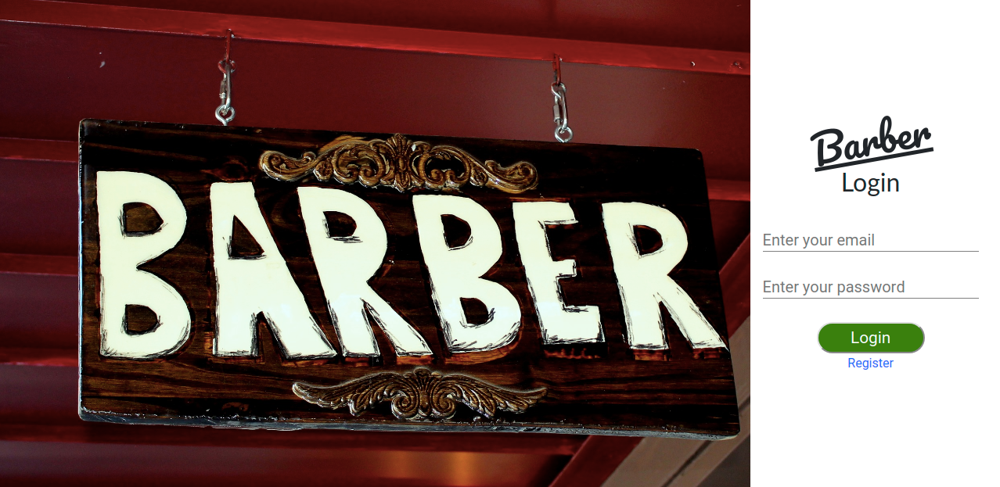
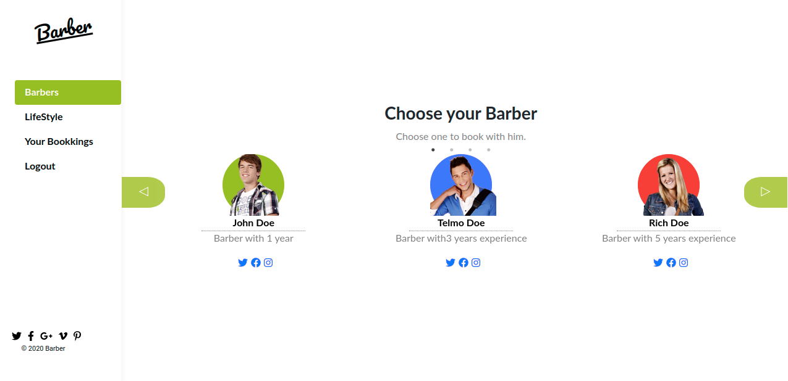
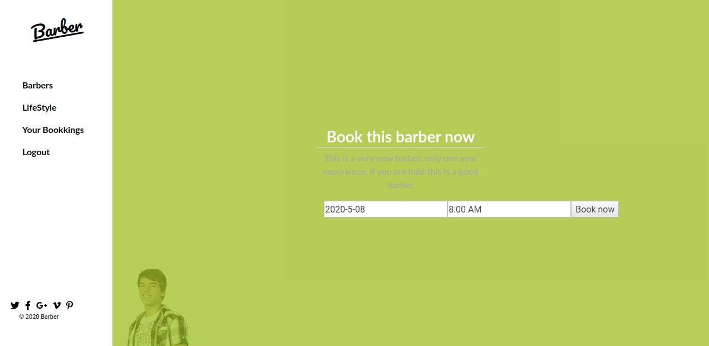
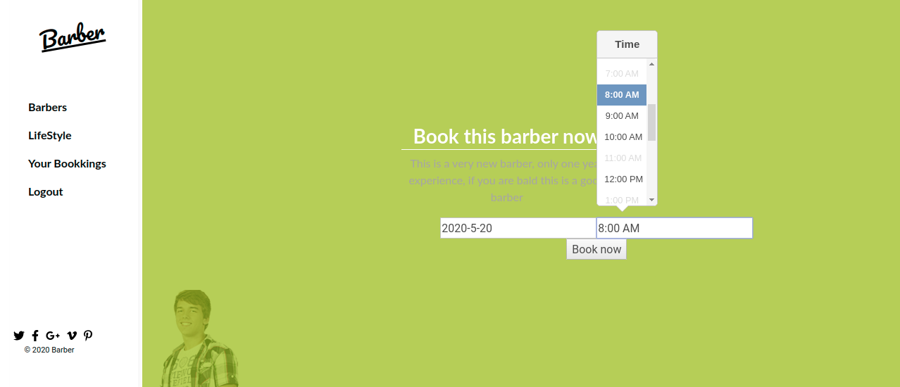

# Barber Booking App

An app that allow users to book a barber. The purpose of the entire project is to work with a full-stack ( ruby on rails and react).

On a new version it will allow the barber to register too.

## Built With

- Javascript
- React
- React-redux
- React-router
- npm
- Ruby on Rails
- CSS
- Html

## Getting Started

Open the [Live Demo Link](https://antoniobarberapi.herokuapp.com/) .
If you don't want to register use this;

- email: test@test.com
- password: 1234

## Author

👤 António Fernandes

[Github](https://github.com/trox115) | [Twitter](https://twitter.com/rock_67) | [LinkedIn](https://www.linkedin.com/in/antoniomfernandes/) | [email](mailto:email@antoniofernandes.com) | [Portfolio](https://www.antoniofernandes.com/)

## 🤝 Contributing

Contributions, issues and feature requests are welcome!

Feel free to check the issues page.

Need More Work:

- Transitions.
- Improve UI/UX (especially the booking table and booking form)
- Barber Register
- Create lifestyle page

## Show your support

Give a star ⭐️ if you like this project!

## Barber App Features

To view the live demo click the [link](https://antoniobarberapi.com) and you will be taken to the login page. You may register or you can login with:

- email: test@test.com
- password: 1234



### Pick a barber

After the login you will be presented with all barbers, you may slide left or right until you find your favourite barber to book an appointment.


### Check de description

After you pick a barber, you can check the description.


### Pick a date and a time

You may now choose your favourite date and time. Note that, if the barber is already booking for that time the time color will be gray. If the barber has all time slots booked, the day will appear as grey and none clickable.



After you book your appointment you will be redirected to your bookings page.

# Running Guide

to get a running version of this project on your machine you have to install node and then follow the instructions, for installing Node go to the [node Oficial site https://nodejs.org/](https://nodejs.org/) and follow the installation instructions

```Shell
your@pc:~$ git clone https://github.com/trox115/booking.git
your@pc:~$ cd booking
your@pc:~$ npm install
your@pc:~$ npm start

```

then you are prompted to your browser to [http://localhost:3000/](http://localhost:3000/)

### Warning: This will only work locally if you download the API

Get it [here](https://github.com/trox115/barber-api)

# About This Project

This project was bootstrapped with [Create React App](https://github.com/facebook/create-react-app).

## Available Scripts

In the project directory, you can run:

### `npm start`

Runs the app in the development mode.<br />
Open [http://localhost:3000](http://localhost:3000) to view it in the browser.

The page will reload if you make edits.<br />
You will also see any lint errors in the console.

### `npm test`

Launches the test runner in the interactive watch mode.<br />
See the section about [running tests](https://facebook.github.io/create-react-app/docs/running-tests) for more information.

### `npm run build`

Builds the app for production to the `build` folder.<br />
It correctly bundles React in production mode and optimizes the build for the best performance.

The build is minified and the filenames include the hashes.<br />
Your app is ready to be deployed!

See the section about [deployment](https://facebook.github.io/create-react-app/docs/deployment) for more information.

### `npm run eject`

**Note: this is a one-way operation. Once you `eject`, you can’t go back!**

If you aren’t satisfied with the build tool and configuration choices, you can `eject` at any time. This command will remove the single build dependency from your project.

Instead, it will copy all the configuration files and the transitive dependencies (Webpack, Babel, ESLint, etc) right into your project so you have full control over them. All of the commands except `eject` will still work, but they will point to the copied scripts so you can tweak them. At this point you’re on your own.

You don’t have to ever use `eject`. The curated feature set is suitable for small and middle deployments, and you shouldn’t feel obligated to use this feature. However we understand that this tool wouldn’t be useful if you couldn’t customize it when you are ready for it.

## Learn More

You can learn more in the [Create React App documentation](https://facebook.github.io/create-react-app/docs/getting-started).

To learn React, check out the [React documentation](https://reactjs.org/).

## Acknowledgments

[Murat Korkmaz on Behance](https://www.behance.net/gallery/26425031/Vespa-Responsive-Redesign) inspired the design.

### License

This project is MIT licensed.
